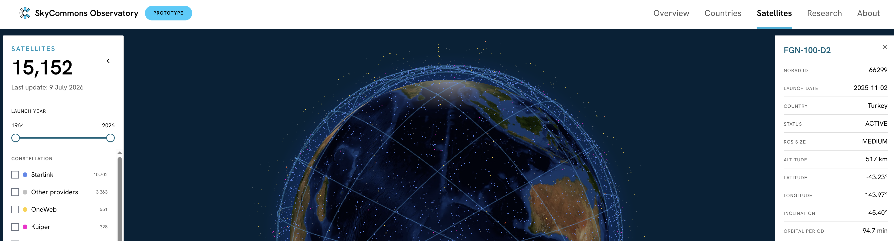

# SkyCommons Observatory

SkyCommons Observatory was created by the Open Knowledge Foundation, a non-profit organisation working at
the intersection of technology, openness, and governance. Since its founding in 2004, OKFN has been a
pioneer in creating tools, standards, and coalitions to make information and technology systems more
transparent, participatory, and accountable.  

We authored the Open Definition, created widely adopted open licensing standards, launched Open Trials to
expose gaps in medical research transparency, and developed the Global Open Data Index, a benchmark adopted
by dozens of governments that led to profound reform of public sector information sharing dynamics.  

Working with local researchers and openly available datasets under its Frontier Technologies umbrella,
as a prototype to map power, expose risks, and advance public-interest principles, such as openness,
interoperability, and accountability, into the technical, legal, and policy frameworks that govern our
SkyCommons, starting with LEO infrastructure with locally produced research, public information, openly
available datasets, accessible narratives and visualisation tools.  

This prototype aims to expand and become a permanent global monitoring node serving not only as a shared
resource but also as a platform for data and research curation, coordination, capacity building and advocacy
in the relevant fora.

Thanks to the team who developed the SkyCommons Observatory prototype:  
Renata Ávila, Burcu Kilic, Solana Larsen, Lucas Pretti, Leticia Coelho

Research team: Joana Varon, Maureen Penjueli, Wahyudi Djafar, Imran Mohd Rasid, Mariam Saliu, Anna Romandash

Website, data and design: Christian Laesser

## Technical description

This repository contains the **prerendered static build output** of the site,
not its source code. The site is built with SvelteKit and exported with the
static adapter; each route directory holds an `index.html` (server-rendered
markup) plus a `__data.json` (serialized page data used for hydration and
client-side navigation).
